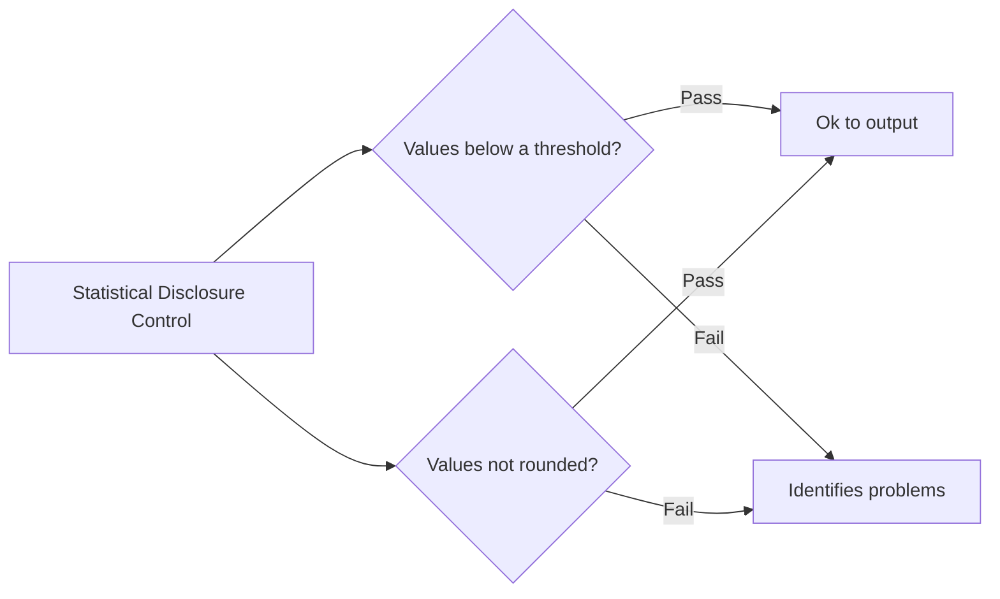

# `output_checker`


[](https://github.com/psf/black)
[](https://opensource.org/licenses/MIT)


`output_checker` is a tool that allows **analysts** to check if their **code is ok to
export**

This will contain functions to do a few different checks for both data outputs and code.

**data outputs**:
- [ ] [Statistical Disclosure Control](./src/disclosure_control_check)

**code outputs**: 
- [ ] *ToDo*: Large files
- [ ] *ToDo*: Files which are too long
- [ ] *ToDo*: Entity Recognition
- [ ] *ToDo*: Embedded tables
- [ ] *ToDo*: notebooks without cleared outputs

Initially, we need to make simple functions which address the above, then we can build other functions which will apply them multiple files.

A core part of the use-case is that there is that people can be alerted what issues there are, in which files.

It does this by running a few simple checks. The envisaged workflow is:


## Getting started

To start using this project, [first make sure your system meets its
requirements](#requirements).

### Requirements

[```Contributors have some additional requirements!```][contributing]

- Python 3.6.1+ installed
- a `.secrets` file with the [required secrets and
  credentials](#required-secrets-and-credentials)
- [load environment variables][docs-loading-environment-variables] from `.env`

To install the Python requirements, open your terminal and enter:

```shell
pip install -r requirements.txt
```

## Required secrets and credentials

To run this project, [you need a `.secrets` file with secrets/credentials as
environmental variables][docs-loading-environment-variables-secrets]. The
secrets/credentials should have the following environment variable name(s):

| Secret/credential | Environment variable name | Description                                |
|-------------------|---------------------------|--------------------------------------------|
| Secret 1          | `SECRET_VARIABLE_1`       | Plain English description of Secret 1.     |
| Credential 1      | `CREDENTIAL_VARIABLE_1`   | Plain English description of Credential 1. |

Once you've added, [load these environment variables using
`.env`][docs-loading-environment-variables].

## Licence

Unless stated otherwise, the codebase is released under the MIT License. This covers
both the codebase and any sample code in the documentation. The documentation is ©
Crown copyright and available under the terms of the Open Government 3.0 licence.

## Contributing

[If you want to help us build, and improve `output_checker`, view our
contributing guidelines][contributing].

## Acknowledgements

[This project structure is based on the `govcookiecutter` template
project][govcookiecutter].

[contributing]: ./docs/contributor_guide/CONTRIBUTING.md
[govcookiecutter]: https://github.com/best-practice-and-impact/govcookiecutter
[docs-loading-environment-variables]: ./docs/user_guide/loading_environment_variables.md
[docs-loading-environment-variables-secrets]: ./docs/user_guide/loading_environment_variables.md#storing-secrets-and-credentials
